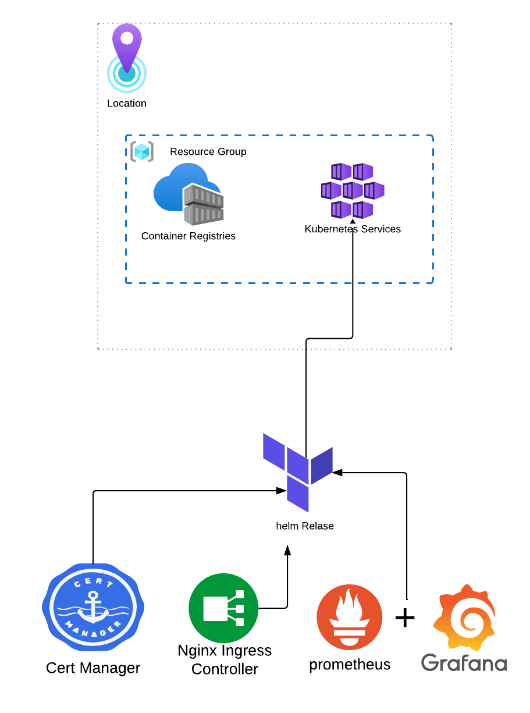

# Azure Kubernetes Infrastructure with Terraform

This directory contains modular Terraform scripts to provision a complete Azure Kubernetes Service (AKS) infrastructure with integrated container registry, monitoring, and ingress capabilities for deploying and managing Python microservices.

## **1. Overview**

This Terraform configuration creates an environment on Azure, including:

- **Azure Container Registry (ACR)** for container image storage
- **Azure Kubernetes Service (AKS)** cluster for container orchestration
- **Cert-Manager** for automatic SSL certificate management
- **NGINX Ingress Controller** for traffic routing and load balancing
- **Prometheus Monitoring Stack** for comprehensive observability

The modular design ensures reusability, maintainability, and easy customization across different environments and use cases.

## **2. Prerequisites**

Before deploying this infrastructure, ensure you have:

- **Azure CLI** installed and configured (`az login`)
- **Terraform** installed (version 1.0+)
- **kubectl** installed for cluster management
- **Helm** installed (version 3.0+)
- **Azure subscription** with appropriate permissions
- **Resource creation permissions** in the target subscription

---

## **3. Architecture Overview**

The infrastructure creates the following Azure resources and Kubernetes components:

```tree
Azure Subscription
├── Resource Group
├── Azure Container Registry (ACR)
│   ├── Container Image Storage
│   └── Admin Access Configuration
├── Azure Kubernetes Service (AKS)
│   ├── System Node Pool
│   ├── Managed Identity
│   └── Auto-scaling Configuration
└── Helm Chart Deployments
    ├── Cert-Manager (SSL Certificates)
    ├── NGINX Ingress Controller (Traffic Routing)
    └── Prometheus Monitoring Stack (Observability)
```

---

## **4. Module Structure**

The Terraform configuration is organized into reusable modules:

### **Infrastructure Modules**

| Module        | Description        | Resources Created                           |
| ------------- | ------------------ | ------------------------------------------- |
| `rg`          | Resource Group     | Azure Resource Group with standardized tags |
| `acr`         | Container Registry | Azure Container Registry with admin access  |
| `aks`         | Kubernetes Service | AKS cluster with node pools and identity    |
| `helm_charts` | Helm Deployments   | Kubernetes applications via Helm charts     |

### **Module Dependencies**

The modules have the following dependency chain:

1. **Resource Group** → Created first, provides foundation
2. **Azure Container Registry** → Depends on Resource Group
3. **Azure Kubernetes Service** → Depends on Resource Group
4. **Helm Charts** → Depend on AKS cluster for deployment

---

## **5. Configuration**

### **Core Variables Configuration**

The `variables.tf` file contains all configurable parameters:

#### **Azure Foundation**

```hcl
variable "subscription_id" {
  description = "Azure Subscription ID"
  type        = string
  default     = "f2df3cc0-75b8-4b87-8230-ab589470a407"
}

variable "location" {
  description = "Azure region for resources"
  type        = string
  default     = "East US"
}

variable "resource_group_name" {
  description = "Name of the Resource Group"
  type        = string
  default     = "aks-resource-group"
}
```

#### **Container Registry Configuration**

```hcl
variable "acr_name" {
  description = "The name of the Azure Container Registry"
  type        = string
  default     = "microservicesAcrRegistry"
}
```

#### **Kubernetes Cluster Configuration**

```hcl
variable "aks_cluster_name" {
  description = "The name of the AKS cluster"
  type        = string
  default     = "myAKSCluster"
}

variable "node_count" {
  description = "Number of nodes in the default node pool"
  type        = number
  default     = 1
}

variable "node_vm_size" {
  description = "VM size for cluster nodes"
  type        = string
  default     = "Standard_D4ads_v6"
}
```

#### **Helm Charts Configuration**

```hcl
# Cert-Manager for SSL certificates
variable "cert_manager-name" {
  description = "The name of the cert-manager chart"
  type        = string
  default     = "cert-manager"
}

# NGINX Ingress for traffic routing
variable "nginx_ingress-name" {
  description = "The name of the nginx-ingress chart"
  type        = string
  default     = "nginx-ingress"
}

# Monitoring stack for observability
variable "monitoring_stack-name" {
  description = "The name of the monitoring stack"
  type        = string
  default     = "kube-prometheus-stack"
}
```

---

## **6. Deployment Instructions**

### **Step 1: Azure Authentication**

```bash
# Login to Azure
az login

# Set the subscription
az account set --subscription "your-subscription-id"

# Verify current subscription
az account show
```

### **Step 2: Deploy Infrastructure**

```bash
# Initialize Terraform
terraform init

# Validate configuration
terraform validate

# Review the execution plan
terraform plan

# Apply the configuration
terraform apply
```

### **Step 3: Configure kubectl**

```bash
# Get AKS credentials
az aks get-credentials --resource-group <resource-group-name> --name <aks-cluster-name>

# Verify cluster connection
kubectl get nodes

# Check all namespaces
kubectl get namespaces
```

### **Step 4: Verify Helm Deployments**

```bash
# Check Helm releases
helm list --all-namespaces

# Verify cert-manager
kubectl get pods -n cert-manager

# Verify nginx-ingress
kubectl get pods -n nginx-ingress

# Verify monitoring stack
kubectl get pods -n monitoring-stack
```

---

## **7. Post-Deployment Configuration**

### **Container Registry Setup**

After deployment, configure your local Docker to work with ACR:

```bash
# Get ACR login server from Terraform output
terraform output acr_login_server

# Login to ACR
az acr login --name <acr-name>

# Test access
docker pull hello-world
docker tag hello-world <acr-login-server>/hello-world:v1
docker push <acr-login-server>/hello-world:v1
```

---

## **8. Module Documentation**

### **Resource Group Module (`modules/rg`)**

**Purpose**: Creates an Azure Resource Group with standardized tagging.

**Inputs**:

- `resource_group_name`: Name of the resource group
- `location`: Azure region
- `environment`: Environment tag (Development/Production)
- `project`: Project identification tag

**Outputs**:

- `resource_group_name`: Name of the created resource group
- `resource_group_id`: Azure resource ID

### **Azure Container Registry Module (`modules/acr`)**

**Purpose**: Creates a container registry for storing Docker images.

**Inputs**:

- `acr_name`: Registry name (must be globally unique)
- `resource_group_name`: Parent resource group
- `location`: Azure region
- `sku`: Registry tier (Basic/Standard/Premium)
- `admin_enabled`: Enable admin access

**Outputs**:

- `acr_login_server`: Registry login URL
- `acr_admin_username`: Admin username
- `acr_admin_password`: Admin password (sensitive)
- `acr_id`: Registry resource ID

### **Azure Kubernetes Service Module (`modules/aks`)**

**Purpose**: Creates a managed Kubernetes cluster with auto-scaling capabilities.

**Inputs**:

- `aks_cluster_name`: Cluster name
- `location`: Azure region
- `resource_group_name`: Parent resource group
- `node_pool_name`: Default node pool name
- `node_count`: Initial number of nodes
- `node_vm_size`: VM size for worker nodes
- `dns_prefix`: DNS prefix for cluster

**Outputs**:

- `kube_config`: Kubernetes configuration (sensitive)
- `kube_config_raw`: Raw kubeconfig content (sensitive)
- `aks_cluster_id`: Cluster resource ID
- `aks_cluster_name`: Cluster name

**Features**:

- Managed identity for secure access
- Auto-scaling node pools
- Integration with Azure networking
- RBAC enabled by default

### **Helm Charts Module (`modules/helm_charts`)**

**Purpose**: Deploys Kubernetes applications using Helm charts.

**Inputs**:

- `charts_name`: Name of the Helm chart
- `repository`: Helm repository URL
- `namespace`: Target Kubernetes namespace
- `charts_version`: Chart version to deploy
- `create_namespace`: Whether to create namespace
- `install_crds`: Install Custom Resource Definitions
- `aks_*`: AKS cluster connection details

**Outputs**:

- `helm_release_name`: Name of the deployed release
- `helm_release_version`: Version of the deployed chart
- `helm_release_namespace`: Deployment namespace
- `helm_release_status`: Current status

**Supported Charts**:

- **Cert-Manager**: Automatic SSL certificate management
- **NGINX Ingress**: Layer 7 load balancing and routing
- **Prometheus Stack**: Comprehensive monitoring solution

---

## **9. Outputs Reference**

The configuration provides comprehensive outputs for integration:

### **Infrastructure Outputs**

```hcl
# Resource Group
output "resource_group_id" - Resource group identifier
output "resource_group_name" - Resource group name

# Container Registry
output "acr_login_server" - Registry login URL
output "acr_admin_username" - Registry admin username
output "acr_admin_password" - Registry admin password (sensitive)
output "acr_id" - Registry resource identifier

# Kubernetes Cluster
output "kube_config" - Cluster configuration (sensitive)
output "aks_cluster_id" - Cluster resource identifier
output "aks_cluster_name" - Cluster name
```

---

## **10. Architecture Diagram**



---

## **11. References**

- [Azure Kubernetes Service Documentation](https://docs.microsoft.com/en-us/azure/aks/)
- [Azure Container Registry Documentation](https://docs.microsoft.com/en-us/azure/container-registry/)
- [Terraform Azure Provider](https://registry.terraform.io/providers/hashicorp/azurerm/latest/docs)
- [Helm Documentation](https://helm.sh/docs/)
- [Cert-Manager Documentation](https://cert-manager.io/docs/)
- [NGINX Ingress Controller](https://kubernetes.github.io/ingress-nginx/)
- [Prometheus Operator](https://prometheus-operator.dev/)
- [Kubernetes Documentation](https://kubernetes.io/docs/)
